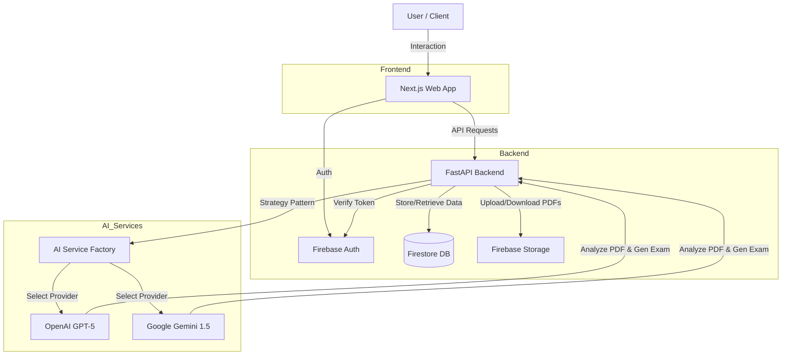

# test.me - AI-Powered Exam Generation Platform

**test.me** is an AI-driven platform that transforms educational materials into interactive exams. It analyzes PDF lecture notes to automatically generate customized questions and grade student answers with detailed feedback, helping students master their coursework effectively.

## 🏗 Architecture

The system follows a modern microservices-like architecture, separating the frontend, backend, and AI services.



### Core Workflow

1.  **Authentication**: Users sign in via Firebase Authentication.
2.  **Upload**: Lecture PDFs are uploaded to Firebase Cloud Storage.
3.  **Generation**: The backend sends the PDF context to the selected AI provider (GPT-5 or Gemini).
4.  **Assessment**: The AI generates questions based on the content.
5.  **Grading**: Student answers are evaluated by the AI against the source material for accuracy.

---

## 🛠 Tech Stack

### Backend
*   **Framework**: FastAPI (Python 3.11+)
*   **Database**: Google Cloud Firestore (NoSQL)
*   **Storage**: Firebase Cloud Storage
*   **Authentication**: Firebase Admin SDK
*   **AI Integration**: OpenAI (GPT-5/4o), Google Generative AI (Gemini 1.5 Pro)
*   **Testing**: pytest

### Frontend
*   **Framework**: Next.js 14 (App Router)
*   **Language**: TypeScript
*   **Styling**: Tailwind CSS, shadcn/ui
*   **State Management**: Zustand
*   **Validation**: Zod + React Hook Form
*   **Internationalization**: next-intl

---

## 📂 Project Structure

```
testme/
├── backend/           # FastAPI Application
│   ├── app/
│   │   ├── models/    # Pydantic Data Models
│   │   ├── routes/    # API Endpoints
│   │   ├── services/  # Business Logic & AI Integrations
│   │   └── utils/     # Helper Functions
│   └── tests/         # Backend Tests
│
├── web-frontend/      # Next.js Application
│   ├── src/
│   │   ├── app/       # App Router Pages
│   │   ├── components/# UI Components
│   │   └── lib/       # Frontend Utilities
│   └── public/        # Static Assets
│
└── scripts/           # Development Scripts
```

---

## 🚀 Getting Started

### Prerequisites

*   Node.js 18+ & npm
*   Python 3.11+
*   Firebase Project (Auth, Firestore, Storage enabled)
*   OpenAI API Key (optional)
*   Google AI API Key (optional)

### 1. Quick Start (Recommended)

Use the provided script to set up the environment and run both services.

```bash
# Setup environment (run once)
./scripts/setup-dev.sh

# Start development servers
./scripts/dev.sh

# Stop servers
./scripts/stop-dev.sh
```

### 2. Manual Setup

#### Backend

1.  Navigate to the backend directory:
    ```bash
    cd backend
    ```
2.  Create and activate a virtual environment:
    ```bash
    python -m venv venv
    source venv/bin/activate  # Windows: venv\Scripts\activate
    ```
3.  Install dependencies:
    ```bash
    pip install -r requirements.txt
    ```
4.  Configure environment:
    *   Copy `.env.example` to `.env` and fill in your API keys.
    *   Place your `serviceAccountKey.json` from Firebase in the `backend/` root.
5.  Run the server:
    ```bash
    python main.py
    ```
    *   API: http://localhost:5000
    *   Docs: http://localhost:5000/docs

#### Frontend

1.  Navigate to the frontend directory:
    ```bash
    cd web-frontend
    ```
2.  Install dependencies:
    ```bash
    npm install
    ```
3.  Configure environment:
    *   Create `.env.local` based on your Firebase configuration.
4.  Run the development server:
    ```bash
    npm run dev
    ```
    *   App: http://localhost:3000

---

## 🤖 AI Strategy & Customization

The backend implements a **Strategy Pattern** for AI services, allowing seamless switching between providers.

*   **Providers**: Currently supports `GPTService` (OpenAI) and `GeminiService` (Google).
*   **Selection**: Clients can specify the preferred provider via query parameters (e.g., `?ai_provider=gemini`).
*   **Extensibility**: New providers can be added by implementing the `AIServiceInterface`.

To configure the default provider, update `DEFAULT_AI_PROVIDER` in `backend/.env`.

---

## 📜 License

This project is licensed under the MIT License.
